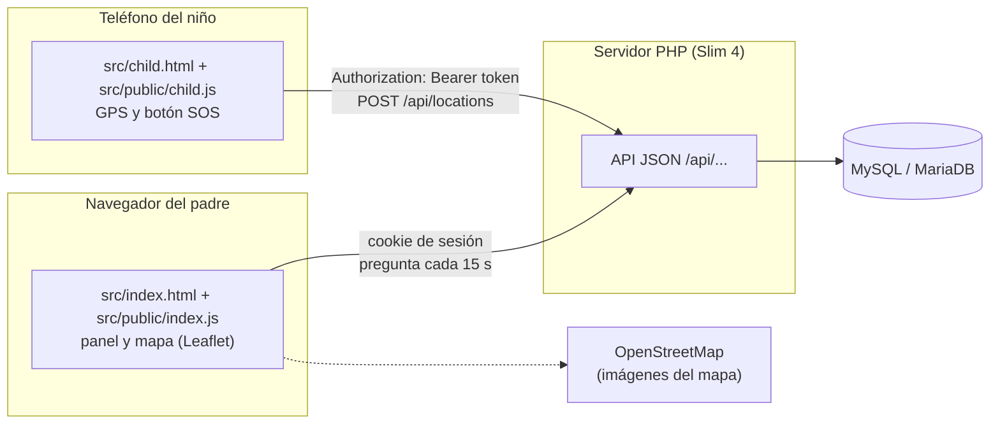
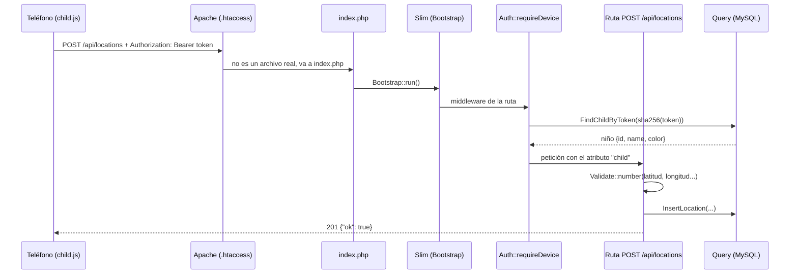
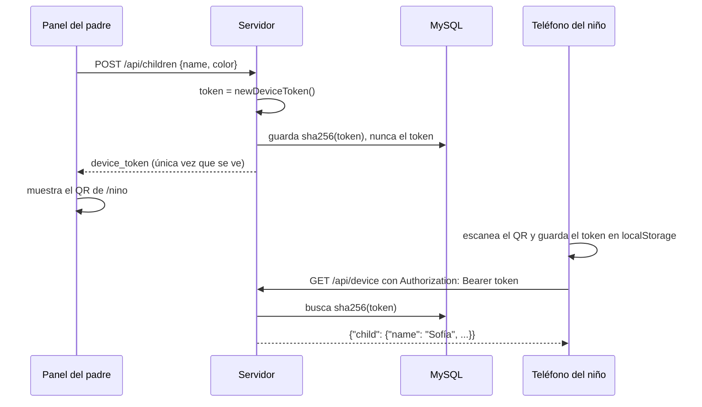
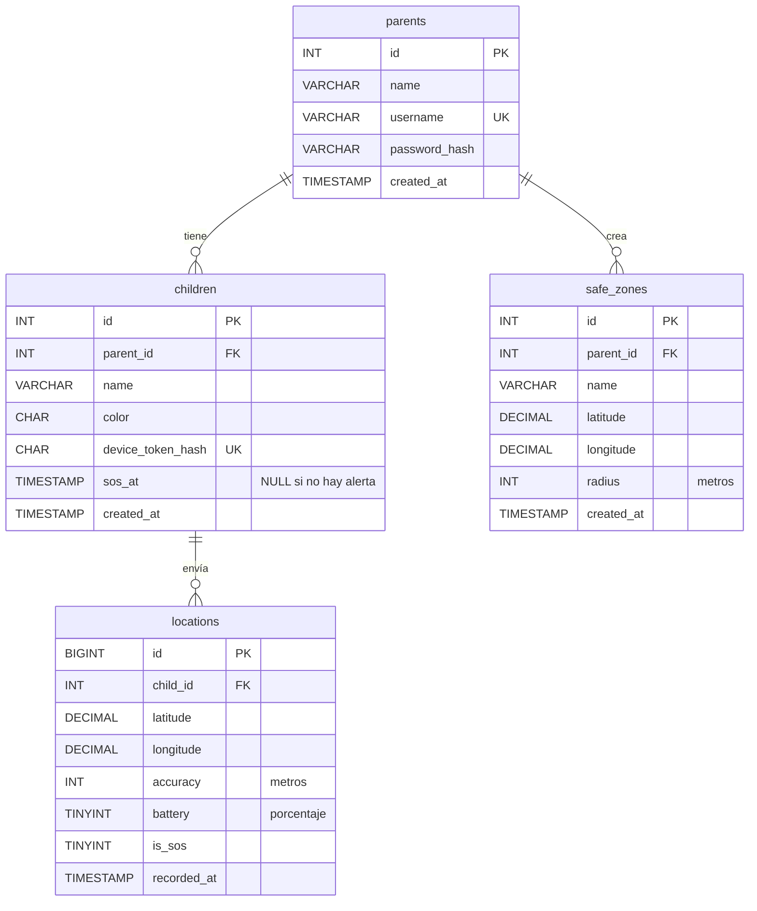
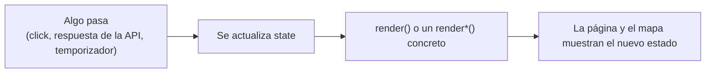
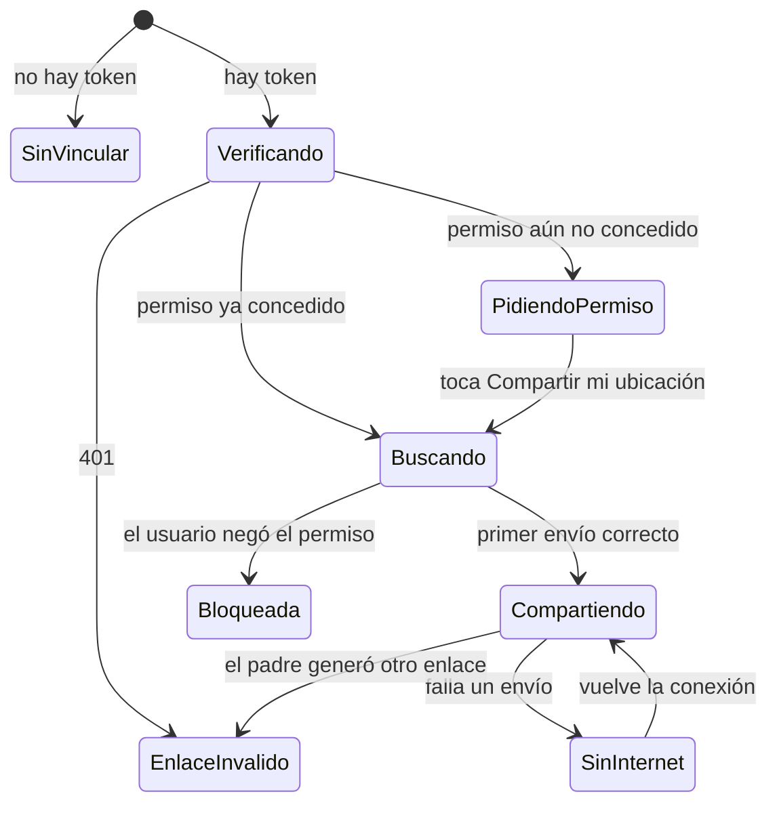

# Guía para desarrolladores de LocateMe

Esta guía es para quien empieza a trabajar en el código. Explica cómo está armada la aplicación,
qué hace cada archivo y cómo hacer los cambios más comunes sin romper nada. Para instalarla y usarla,
lee primero el [README](../README.md).

Además de esta guía, **cada archivo del código tiene comentarios** que explican qué hace cada clase,
función y ruta de la API. Esta guía da el panorama general y te dice dónde buscar.

## Índice

1. [Qué es LocateMe](#1-qué-es-locateme)
2. [Glosario](#2-glosario)
3. [Arrancar el proyecto en tu computadora](#3-arrancar-el-proyecto-en-tu-computadora)
4. [Vista general](#4-vista-general)
5. [Estructura de carpetas](#5-estructura-de-carpetas)
6. [El camino de una petición](#6-el-camino-de-una-petición)
7. [Backend (PHP)](#7-backend-php)
8. [Base de datos](#8-base-de-datos)
9. [Panel de los padres (index.js)](#9-panel-de-los-padres-indexjs)
10. [Página del niño (child.js)](#10-página-del-niño-childjs)
11. [Seguridad: reglas que no se rompen](#11-seguridad-reglas-que-no-se-rompen)
12. [Recetas para cambios comunes](#12-recetas-para-cambios-comunes)
13. [Cómo probar tus cambios](#13-cómo-probar-tus-cambios)
14. [Problemas comunes](#14-problemas-comunes)
15. [Convenciones del código](#15-convenciones-del-código)

---

## 1. Qué es LocateMe

Una aplicación web para que los padres sepan dónde están sus hijos. Tiene dos pantallas:

- **Panel de los padres** (`/`): un mapa con la última ubicación de cada hijo, su batería, el recorrido
  de las últimas 24 horas, zonas seguras (casa, escuela…) y avisos cuando un hijo llega a una zona, sale
  de ella o pide ayuda.
- **Página del niño** (`/nino`): se abre en el teléfono del niño con un enlace o código QR. Envía su
  ubicación cada cierto tiempo y tiene un botón **SOS**.

En medio hay un servidor PHP que guarda todo en MySQL y ofrece una API JSON (`/api/...`).

## 2. Glosario

| Término | Qué significa en el código |
| --- | --- |
| **Padre / usuario** | Quien entra al panel. Tabla `parents`, trait `Users`, atributo `user_id` en las rutas. |
| **Hijo / niño** | Tabla `children`. Cada uno pertenece a un padre (`parent_id`). |
| **Teléfono / dispositivo** | El celular del niño con `/nino` abierto. Sus rutas usan la palabra *device*. |
| **Token del teléfono** | Contraseña aleatoria que identifica al teléfono. En la base sólo se guarda su hash (`device_token_hash`). |
| **Enlace de vinculación** | `/nino#t=<token>`. Es lo que contiene el código QR. |
| **Zona segura** | Círculo (centro y radio en metros) en la tabla `safe_zones`. |
| **SOS** | Alerta del niño. `children.sos_at` (pendiente) y `locations.is_sos` (en qué punto fue). |
| **Sin señal** (*stale*) | El teléfono no ha enviado su ubicación en más de 15 minutos. |
| **Router Model** | Clase en `src/Router/Models/` que agrupa las rutas de un recurso. |
| **Middleware** | Función que se ejecuta antes o después de una ruta (por ejemplo, revisar la sesión). |

## 3. Arrancar el proyecto en tu computadora

Necesitas **PHP 8.1 o más nuevo** (con la extensión `pdo_mysql`), **Composer** y **MySQL 5.7+ o MariaDB 10.3+**.

```bash
composer install                     # descarga Slim y las demás dependencias en vendor/
cp .env.example .env                 # y llena los datos de tu base de datos
mysql -u root -p -e "CREATE DATABASE locateme CHARACTER SET utf8mb4 COLLATE utf8mb4_unicode_ci"
mysql -u root -p locateme < database/schema.sql
php -S localhost:8000 index.php      # servidor de desarrollo
```

Abre <http://localhost:8000>. En tu `.env` de desarrollo pon `APP_DEBUG=true` para ver el detalle de los errores.

### Simular el teléfono del niño sin un teléfono

1. En el panel, crea tu cuenta, agrega un hijo y copia el enlace que aparece.
2. Ábrelo en **otra ventana** del navegador (o en una ventana de incógnito).
3. En Chrome abre las DevTools → menú ⋮ → *More tools* → **Sensors** → *Location* y escribe una latitud y
   longitud. Cambiarlas simula que el niño se mueve.

También puedes mandar ubicaciones con `curl` (el token es lo que va después de `#t=` en el enlace):

```bash
curl -X POST http://localhost:8000/api/locations \
  -H "Authorization: Bearer <token>" -H "Content-Type: application/json" \
  -d '{"latitude": 32.6040599, "longitude": -115.4804385, "accuracy": 15, "battery": 80}'
```

> El navegador sólo deja usar el GPS en páginas **https://** o en `localhost`. Para probar con un teléfono
> real necesitas publicar la app con HTTPS o usar un túnel HTTPS (por ejemplo ngrok o Cloudflare Tunnel).

## 4. Vista general



Tres ideas clave:

- **El servidor no avisa por su cuenta**: el panel le pregunta cada 15 segundos (`refresh()` en `index.js`).
  A esto se le llama *polling*.
- **Hay dos formas de identificarse**: los padres con una **cookie de sesión** y el teléfono del niño con
  un **token** en la cabecera `Authorization`.
- **La lógica de las zonas vive en el navegador**: el servidor guarda ubicaciones y zonas; decidir si un niño
  está "En Casa" o "Fuera de zonas seguras" lo hace `statusOf()` en `index.js`.

## 5. Estructura de carpetas

```text
locateme/
├── index.php                  Punto de entrada: toda petición que no es un archivo estático llega aquí
├── .htaccess                  Apache: bloquea los archivos privados y manda todo lo demás a index.php
├── .env.example               Plantilla de configuración (se copia a .env, que NUNCA se sube a git)
├── composer.json / .lock      Dependencias de PHP (Slim, slim/psr7, phpdotenv)
├── database/
│   └── schema.sql             Tablas de la base de datos
├── docs/
│   └── GUIA-DESARROLLO.md     Esta guía
├── vendor/                    Dependencias instaladas por Composer (no se sube a git)
└── src/
    ├── index.html             HTML del panel de los padres
    ├── child.html             HTML de la página del niño
    ├── public/                Lo ÚNICO de src/ que el navegador puede descargar directamente
    │   ├── index.js           Lógica del panel
    │   ├── child.js           Lógica de la página del niño
    │   └── style.css          Estilos de ambas páginas
    ├── Bootstrap/
    │   └── Bootstrap.php      Arranca Slim: .env, rutas, middleware y manejo de errores
    ├── Router/
    │   ├── Base/BaseRouter.php        Clase base de los Router Models
    │   └── Models/
    │       ├── Pages/         GET / y GET /nino (entregan los HTML)
    │       ├── Users/         registro, inicio y cierre de sesión, /api/me
    │       ├── Children/      hijos, recorrido, enlace del teléfono, SOS
    │       ├── Locations/     rutas que usa el teléfono del niño
    │       └── Zones/         zonas seguras
    └── Helpers/
        ├── Auth.php           Sesión de padres y token de teléfonos (middleware)
        ├── Http.php           Respuestas JSON y lectura del cuerpo de la petición
        ├── Validate.php       Validación de los datos de entrada
        └── Database/
            ├── MySQL/Connection.php   Conexión PDO y run() para consultas seguras
            ├── Query.php              Junta todos los traits de consultas en una clase
            └── Models/                Consultas por tabla: Users, Children, Locations, Zones
```

## 6. El camino de una petición

Así viaja una ubicación desde el teléfono del niño hasta la base de datos:



Paso a paso:

1. **Apache** revisa el `.htaccess`. Si la URL es un archivo privado responde 403; si es un archivo de
   `src/public` lo entrega tal cual; si no, pasa la petición a `index.php`.
   (Con `php -S`, el bloque `cli-server` al inicio de `index.php` entrega los archivos de `src/public` y
   manda todo lo demás a Slim, que responde 404 a los archivos privados.)
2. **`index.php`** carga `Bootstrap` y llama a `Bootstrap::run()`.
3. **`Bootstrap::run()`** carga `vendor/autoload.php`, lee el `.env`, crea la app de Slim, registra todas las
   rutas (`LoadRoutes`) y los middleware (`SetupMiddleware`), y ejecuta la app.
4. **Slim** recorre los middleware en este orden:

   ```text
   petición → errores → routing → cabeceras de seguridad → middleware de la ruta (Auth) → ruta
   ```

   El de *routing* encuentra qué ruta corresponde a la URL. Si ninguna coincide, el de errores responde
   `404 {"error": "No encontrado."}`.
5. **El middleware de la ruta** (`Auth::requireUser()` o `Auth::requireDevice()`) verifica quién llama. Si no
   es válido responde 401 y la ruta nunca se ejecuta.
6. **La ruta** valida los datos, consulta la base con `Query::...` y responde con `Http::json()` o `Http::error()`.
7. Si algo lanza una excepción (por ejemplo, la base de datos está caída), el middleware de errores la atrapa,
   la escribe en el log de PHP y responde `500 {"error": "Ocurrió un error en el servidor..."}`.

## 7. Backend (PHP)

### 7.1 Cómo se organizan las rutas (Router Models)

Cada recurso tiene una carpeta en `src/Router/Models/`:

```text
Zones/
├── Zones.php            clase que lista las rutas en $Methods
└── Methods/
    ├── GET.php          trait con los métodos que registran rutas GET
    ├── POST.php         ...rutas POST
    └── DELETE.php       ...rutas DELETE
```

La clase lista los nombres de los métodos que registran rutas:

```php
class Zones extends BaseRouter
{
    use Methods\GET;
    use Methods\POST;
    use Methods\DELETE;

    protected $Methods = [
        'GET'    => ['zones'],
        'POST'   => ['addZone'],
        'DELETE' => ['removeZone'],
    ];
}
```

`Bootstrap::LoadRoutes()` crea cada clase de `Bootstrap::$Models` y llama a `addRoutes()` (de `BaseRouter`),
que a su vez llama a cada método de `$Methods`. **Si agregas un método a un trait pero no lo pones en
`$Methods`, la ruta no existe.**

Así se ve una ruta por dentro:

```php
public function zones()                                        // (1) nombre listado en $Methods
{
    Bootstrap::getBootstrapApp()                               // (2) la app de Slim
        ->get('/api/zones',                                    // (3) método HTTP y URL
            function (Request $request, Response $response, $args) {
                $userId = $request->getAttribute('user_id');   // (4) lo dejó el middleware de sesión
                return Http::json($response, [                 // (5) respuesta JSON
                    'zones' => Query::GetZones($userId),
                ]);
            })
        ->add(Auth::requireUser());                            // (6) middleware sólo para esta ruta
}
```

- Los parámetros de la URL llegan en `$args`: en `'/api/zones/{id:[0-9]+}'`, el id está en `$args['id']`
  (como texto, por eso se convierte con `(int)`). El `[0-9]+` hace que Slim sólo acepte números.
- Los parámetros de consulta (`?hours=24`) se leen con `$request->getQueryParams()`.
- El cuerpo JSON se lee con `Http::body($request)`.

### 7.2 Helpers

| Archivo | Para qué se usa |
| --- | --- |
| `Http.php` | `Http::json()` y `Http::error()` para responder; `Http::body()` para leer el JSON que llega. |
| `Validate.php` | `text()`, `username()`, `number()` y `color()`. Devuelven el valor limpio o `null` si no es válido. |
| `Auth.php` | Sesión de padres (`login`, `logout`, `requireUser`) y teléfonos (`newDeviceToken`, `hashToken`, `requireDevice`). |

El patrón de validación que se repite en todas las rutas:

```php
$body = Http::body($request) ?? [];
$name = Validate::text($body['name'] ?? null, 1, 40);

if ($name === null) {
    return Http::error($response, 'Escribe el nombre (máximo 40 letras).');
}
```

### 7.3 Base de datos desde PHP

- `Connection` (en `Helpers/Database/MySQL/`) abre **una sola** conexión PDO por petición y ofrece
  `self::run($sql, $params)`, que siempre usa sentencias preparadas.
- Las consultas están en **traits por tabla** (`Helpers/Database/Models/`) y `Query` los junta. Desde
  una ruta se usa todo igual: `Query::GetChildren($userId)`, `Query::InsertZone(...)`.
- Las consultas devuelven arreglos ya listos para JSON: números convertidos a `int`/`float` y fechas en
  ISO 8601 con `self::isoDate()`.

### 7.4 Autenticación: dos tipos de usuario

| | Padres | Teléfono del niño |
| --- | --- | --- |
| Cómo se identifica | Cookie de sesión `locateme_session` | Cabecera `Authorization: Bearer <token>` |
| Cómo la obtiene | `POST /api/login` o `/api/register` | Enlace `/nino#t=<token>` generado por el padre |
| Middleware | `Auth::requireUser()` → atributo `user_id` | `Auth::requireDevice()` → atributo `child` |
| Qué se guarda en la base | `password_hash()` de la contraseña | `sha256` del token |
| Cómo se revoca | `POST /api/logout` | El padre genera un enlace nuevo con «Vincular» |

Así se vincula un teléfono:



¿Por qué el token va después de `#`? Porque esa parte de la URL (el *fragmento*) **nunca se envía al
servidor**: así el token no queda escrito en los logs de Apache ni de ningún proxy.

### 7.5 Errores

- Todas las respuestas de error tienen la forma `{"error": "mensaje"}` y el panel muestra el mensaje tal cual.
  Por eso los mensajes están **en español y pensados para padres**, no para programadores.
- Los errores 500 se escriben en el log de PHP (`error_log`). Con `APP_DEBUG=true` el mensaje incluye además
  el detalle técnico. **Nunca** actives `APP_DEBUG` en producción.
- Códigos que usamos: `400` dato inválido, `401` sin sesión o token inválido, `403` acción no permitida,
  `404` no existe (o es de otra familia), `409` ya existe, `500` error del servidor.

## 8. Base de datos



Detalles importantes:

- **Todo en UTC.** La conexión ejecuta `SET time_zone = '+00:00'`, las fechas salen como
  `2026-09-27T18:00:00Z` y el navegador las muestra en la hora local de cada padre.
- **`DECIMAL(9,6)`** para coordenadas: 6 decimales son unos 11 cm de precisión, más que suficiente.
- **Borrado en cascada**: al borrar un padre se borran sus hijos y zonas; al borrar un hijo, sus ubicaciones.
- **`sos_at` vs `is_sos`**: `children.sos_at` es la alerta *pendiente* (la quita el padre con «Marcar
  atendida»); `locations.is_sos` marca *en qué punto* del recorrido se pidió ayuda.
- **Retención**: `POST /api/locations` borra, de vez en cuando, las ubicaciones más viejas que
  `LOCATION_RETENTION_DAYS` (30 días por defecto). Son datos de menores de edad: no los guardes más de lo necesario.
- El índice `(child_id, recorded_at)` hace rápidas las dos consultas más frecuentes: la última ubicación y el recorrido.

**Cambiar el esquema:** no hay un sistema de migraciones. Si agregas o cambias una columna, actualiza
`database/schema.sql` (para instalaciones nuevas) e incluye en tu PR el `ALTER TABLE` que hay que correr en
las bases que ya existen.

## 9. Panel de los padres (index.js)

Es JavaScript sin frameworks ni compilación. Usa dos librerías que se cargan desde un CDN con integridad
verificada (SRI): **Leaflet** para el mapa y **qrcode-generator** para el código QR.

### 9.1 El patrón estado → render

Todo lo que se ve sale del objeto `state`. Cuando algo cambia se sigue siempre el mismo camino:



Por ejemplo, al borrar una zona: se llama a la API, se quita la zona de `state.zones` y se llama a `render()`.
**No modifiques el HTML directamente desde una acción**: cambia `state` y deja que las funciones render dibujen.

### 9.2 Crear HTML de forma segura: `h()`

```js
h('button', { class: 'chip-btn', onclick: () => toggleHistory(child) }, icon('route'), 'Recorrido')
```

`h()` agrega el texto como texto, nunca como HTML. Así, si un padre nombra a su hijo ``,
se ve literal y no se ejecuta nada (esto se llama XSS). **Nunca uses `innerHTML` con datos que vienen de un
usuario.** Para Leaflet, que sí recibe HTML, usa `escapeHtml()`.

### 9.3 El ciclo de actualización

- `refresh()` pide `GET /api/children` y `GET /api/zones` al mismo tiempo, guarda los datos en `state` y llama
  a `render()`.
- `schedulePoll()` programa el siguiente `refresh()` a los 15 s (`POLL_MS`). También se actualiza al volver a
  la pestaña y con el botón de actualizar.
- `detectChanges()` compara el estado nuevo con el anterior para avisar con `notify()`: «Sofía llegó a Casa»,
  «Luis salió de Escuela», «¡Sofía pidió ayuda!».

### 9.4 El estado de cada hijo: `statusOf()`

| Prioridad | `key` | Color | Cuándo |
| --- | --- | --- | --- |
| 1 | `sos` | rojo | Tiene una alerta SOS sin atender |
| 2 | `none` | gris | Su teléfono nunca ha enviado ubicación |
| 3 | `stale` | gris | Su última ubicación tiene más de 15 min (`STALE_MINUTES`) |
| 4 | `zone:ID` | verde | Está dentro de una zona segura |
| 5 | `away` | ámbar | Hay zonas creadas y no está en ninguna |
| 6 | `active` | morado | No hay zonas creadas; sólo está compartiendo |

El color sale de las clases `.tone-*` de `style.css`.

### 9.5 El mapa

- `initMap()` crea el mapa una sola vez con cuatro capas: zonas → recorrido → precisión del GPS → niños.
- Los pines de los niños **se reutilizan** entre actualizaciones (`markers`) para que no parpadeen.
- El pin es un `divIcon` de Leaflet con HTML y CSS propios (`.kid-marker`, `.kid-pin`). Su punta está 56 px
  debajo del borde superior; si cambias su tamaño, ajusta `iconAnchor` en `kidIcon()`.
- Si Leaflet no carga (sin internet), `map` queda en `null` y la lista de hijos sigue funcionando.

### 9.6 Diálogos

Se usan elementos `<dialog>` nativos: `showModal()` para abrir y los botones con el atributo `data-close` para
cerrar. `confirmDialog()` devuelve una promesa, así que se usa con `if (await confirmDialog({...}))`.

## 10. Página del niño (child.js)



**Cuándo se envía la ubicación** (`sendIfNeeded()`, se revisa con cada lectura del GPS y cada 5 s):

| Condición | Constante |
| --- | --- |
| Nunca se ha enviado | — |
| Pasó 1 minuto desde el último envío, aunque no se haya movido | `SEND_EVERY_MS` |
| Se movió 25 m o más y pasaron al menos 5 s | `MOVE_METERS`, `MIN_GAP_MS` |

**Botón SOS**: hay que mantenerlo presionado 1.5 s (`SOS_HOLD_MS`) para evitar toques accidentales. Envía
`{"sos": true}` junto con la ubicación si la hay (si todavía no hay GPS, la alerta se manda igual) y, si
no hay internet, reintenta cada 5 s.

**Limitación importante**: es una página web. Si el niño cierra la pestaña o el teléfono suspende el
navegador, deja de enviar. Resolverlo requiere una app nativa o una PWA con permisos de ubicación en
segundo plano.

## 11. Seguridad: reglas que no se rompen

Esta app maneja **la ubicación de niños**. Antes de abrir un PR, revisa esta lista:

1. **SQL**: toda consulta pasa por `self::run()` con `?`. Nunca concatenes datos del usuario en el SQL.
2. **Cada familia sólo ve lo suyo**: toda consulta de una ruta de padres filtra por el `user_id` de la sesión
   (`WHERE ... AND parent_id = ?`). Si un registro no es del padre, responde **404** (no 403), para no
   revelar que existe.
3. **XSS**: en el frontend, nunca `innerHTML` con datos del usuario; usa `h()` o `textContent`, y
   `escapeHtml()` para Leaflet.
4. **Valida en el servidor** con `Validate`, aunque el HTML ya tenga `required` o `maxlength`.
5. **Lee el cuerpo con `Http::body()`**: sólo acepta JSON y eso protege contra CSRF.
6. **Nunca respondas** `password_hash` ni `device_token_hash`.
7. **Contraseñas** con `password_hash()`/`password_verify()`; **tokens** aleatorios con `hashToken()`.
8. **Secretos en `.env`**, nunca en el código ni en git. Si agregas una variable, agrégala también a
   `.env.example` con un valor de ejemplo.
9. **Librerías externas**: versión fija, atributo `integrity` y su dominio en la CSP (ver receta 12.4).
10. **Privacidad**: no escribas coordenadas en los logs y respeta la retención de datos.

## 12. Recetas para cambios comunes

### 12.1 Agregar un endpoint: renombrar a un hijo

Objetivo: `PATCH /api/children/{id}` con `{"name": "Sofi"}`.

**1. La consulta**, en `src/Helpers/Database/Models/Children.php`:

```php
/** Cambia el nombre del niño. */
public static function RenameChild(int $childId, int $parentId, string $name): void
{
    self::run(
        'UPDATE children SET name = ? WHERE id = ? AND parent_id = ?',
        [$name, $childId, $parentId]
    );
}
```

> Ojo: en MySQL, `rowCount()` de un `UPDATE` cuenta las filas que **cambiaron**. Si el nombre nuevo es igual
> al anterior devuelve 0, aunque el niño exista. Por eso la ruta revisa primero con `FindChild()`.

**2. La ruta**, en un archivo nuevo `src/Router/Models/Children/Methods/PATCH.php`:

```php
<?php

namespace Src\Router\Models\Children\Methods;

use Src\Bootstrap\Bootstrap;
use Psr\Http\Message\ResponseInterface as Response;
use Psr\Http\Message\ServerRequestInterface as Request;
use Src\Helpers\Auth;
use Src\Helpers\Http;
use Src\Helpers\Validate;
use Src\Helpers\Database\Query;

trait PATCH {

    /**
     * PATCH /api/children/{id} — cambia el nombre del niño.
     *
     * Cuerpo JSON: { "name": "Sofi" }. Respuesta: { "child": { id, name, color } }
     */
    public function renameChild()
    {
        Bootstrap::getBootstrapApp()->patch('/api/children/{id:[0-9]+}', function (Request $request, Response $response, $args) {

            $userId = $request->getAttribute('user_id');
            $body = Http::body($request) ?? [];
            $name = Validate::text($body['name'] ?? null, 1, 40);

            if ($name === null) {
                return Http::error($response, 'Escribe el nombre (máximo 40 letras).');
            }
            if (Query::FindChild((int) $args['id'], $userId) === null) {
                return Http::error($response, 'No encontramos a ese niño.', 404);
            }

            Query::RenameChild((int) $args['id'], $userId, $name);

            return Http::json($response, ['child' => Query::FindChild((int) $args['id'], $userId)]);
        })->add(Auth::requireUser());
    }

}
```

**3. Regístrala** en `src/Router/Models/Children/Children.php`: agrega `use Methods\PATCH;` y
`'PATCH' => ['renameChild']` a `$Methods`.

**4. Regenera el autoload** (creaste un archivo nuevo):

```bash
composer dump-autoload
```

**5. Pruébala** con `curl` guardando la cookie de sesión:

```bash
curl -c cookies.txt -H "Content-Type: application/json" \
  -d '{"username": "ana", "password": "tu-contraseña"}' http://localhost:8000/api/login
curl -b cookies.txt -X PATCH -H "Content-Type: application/json" \
  -d '{"name": "Sofi"}' http://localhost:8000/api/children/1
```

**6. Úsala en el panel** (`index.js`):

```js
await api('PATCH', `children/${child.id}`, { name });
await refresh();
```

**7. Documéntala** en la tabla de la API del README.

### 12.2 Agregar un dato nuevo a las ubicaciones (por ejemplo, la velocidad)

1. Base de datos: `ALTER TABLE locations ADD COLUMN speed FLOAT NULL;` y actualiza `database/schema.sql`.
2. Consulta: agrega el parámetro a `InsertLocation()` en `Models/Locations.php` (y a los `SELECT` que lo necesiten).
3. Ruta `POST /api/locations`: valídalo con `Validate::number($body['speed'] ?? null, 0, 100)` y pásalo a `InsertLocation()`.
4. Teléfono: en `send()` de `child.js`, agrega `body.speed = coords.speed` (puede venir `null`).
5. Panel: muéstralo en `childCard()` de `index.js`.

### 12.3 Agregar un grupo de rutas nuevo (un Router Model)

1. Crea `src/Router/Models/<Nombre>/<Nombre>.php` con una clase que `extends BaseRouter`, y sus traits en `Methods/`.
2. Agrega la clase a `Bootstrap::$Models`.
3. Ejecuta `composer dump-autoload`.

### 12.4 Agregar una librería desde un CDN

1. Usa una **versión fija** (`paquete@1.2.3`), nunca "latest".
2. Calcula su hash de integridad y agrégalo al `<script>` o `<link>` con `integrity="sha256-..."` y `crossorigin`:

   ```bash
   curl -s https://cdn.jsdelivr.net/npm/paquete@1.2.3/archivo.js | openssl dgst -sha256 -binary | openssl base64 -A
   ```

3. Agrega el dominio del CDN a la Content-Security-Policy en `src/Router/Models/Pages/Methods/GET.php`.

### 12.5 Cambiar tiempos y límites

| Qué | Dónde |
| --- | --- |
| Cada cuánto se actualiza el panel | `POLL_MS` en `index.js` |
| Minutos para considerar «Sin señal» | `STALE_MINUTES` en `index.js` |
| Horas del recorrido | `HISTORY_HOURS` en `index.js` (el servidor acepta hasta 168) |
| Cada cuánto envía el teléfono | `SEND_EVERY_MS`, `MOVE_METERS`, `MIN_GAP_MS` en `child.js` |
| Tiempo para mantener el SOS | `SOS_HOLD_MS` en `child.js` |
| Días que se guarda el historial | `LOCATION_RETENTION_DAYS` en `.env` |
| Radio mínimo y máximo de una zona | `Validate::number(..., 30, 5000)` en `Zones/Methods/POST.php` y el `<input type="range">` de `index.html` |

### 12.6 Cambiar textos y colores

- Los textos están directamente en `index.html`, `child.html`, `index.js` y `child.js` (y los mensajes de
  error en las rutas PHP). Todos en español.
- Los colores de la interfaz son variables CSS al inicio de `style.css` (`--brand`, `--ok`, `--danger`…),
  con su versión para modo oscuro justo debajo.
- Los colores que se pueden elegir para cada hijo están en `CHILD_COLORS` (`index.js`).

## 13. Cómo probar tus cambios

Todavía no hay pruebas automáticas en el repositorio. Antes de abrir un PR:

- [ ] Revisa la sintaxis:

      ```bash
      find . -path ./vendor -prune -o -name '*.php' -exec php -l {} \;
      node --check src/public/index.js && node --check src/public/child.js
      ```

- [ ] La consola del navegador (F12) no muestra errores.
- [ ] Recorrido completo: crear cuenta → agregar hijo → abrir el enlace en otra ventana con ubicación
      simulada → ver el pin → crear una zona → mover la ubicación → recibir el aviso de salida → SOS →
      marcar atendida → generar un enlace nuevo (el anterior debe dejar de funcionar).
- [ ] Con **otra cuenta** de padre, confirma que no ves ni puedes modificar nada de la primera
      (por ejemplo, `curl -b cookies-otro.txt http://localhost:8000/api/children/1/locations` debe dar 404).
- [ ] Vista móvil (DevTools → icono de dispositivo) y modo oscuro (DevTools → *Rendering* →
      *prefers-color-scheme: dark*).

## 14. Problemas comunes

| Síntoma | Causa y solución |
| --- | --- |
| `Class "Src\..." not found` después de crear un archivo | El autoload usa *classmap*: ejecuta `composer dump-autoload`. |
| Una ruta nueva responde 404 | El método no está en `$Methods`, el Router Model no está en `Bootstrap::$Models`, o en Apache falta `mod_rewrite` / `AllowOverride All`. |
| `{"error": "Ocurrió un error en el servidor..."}` | Revisa el log de errores de PHP. Con `APP_DEBUG=true` el detalle aparece en el mensaje. |
| `400 Se esperaba un cuerpo JSON` o los datos se ignoran | Falta la cabecera `Content-Type: application/json`. |
| 401 en todas las rutas aunque iniciaste sesión | PHP no puede guardar las sesiones: revisa que `session.save_path` exista y tenga permisos de escritura. |
| La página del niño dice «La página debe abrirse con https://» | El GPS sólo funciona con HTTPS o en `localhost`. |
| El mapa no aparece y la consola dice *Refused to load… Content Security Policy* | Falta el dominio en la CSP (`Pages/Methods/GET.php`). |
| Las horas se ven corridas | Las fechas se guardan en UTC. Si insertas datos a mano usa `UTC_TIMESTAMP()`, y no quites el `SET time_zone` de `Connection`. |
| Cambié CSS/JS y no se ve el cambio | Caché del navegador: recarga con Ctrl+Shift+R (Cmd+Shift+R en Mac). |

## 15. Convenciones del código

- **Idioma**: nombres de variables, funciones y clases en inglés; comentarios, mensajes y textos de la
  interfaz en español.
- **PHP**: las consultas de `Query` usan `PascalCase` (`GetChildren`, `InsertZone`); los métodos de rutas,
  `camelCase` (`addChild`, `removeZone`). Una ruta por método.
- **JSON**: claves en `snake_case` (`last_location`, `recorded_at`, `device_token`); fechas en ISO 8601 UTC;
  errores siempre como `{"error": "..."}`.
- **CSS**: variables para todos los colores; clases `.tone-*` para estados de color y `.is-*` para estados
  que agrega JavaScript.
- **Comentarios**: explica el *porqué* (una decisión, un límite, un riesgo de seguridad), no lo que ya dice
  el código.
